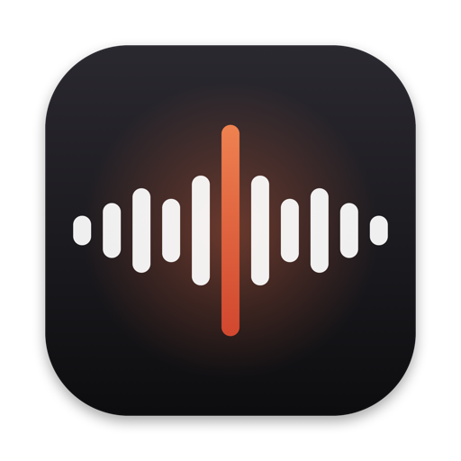

<p align="center"></p>
<h1 align="center">Oneshot</h1>
<p align="center"><b>Say it once.</b> Free, open-source voice dictation for Mac.</p>
<p align="center"><a href="https://oneshot.agenturl.dev">Website</a> · <a href="https://github.com/brunoqgalvao/oneshot/releases/latest">Download</a></p>

Hold a key, talk like you normally talk, and clean, punctuated text lands wherever your cursor is: Slack, Gmail, Cursor, Notion, the terminal.

```sh
curl -fsSL https://oneshot.agenturl.dev/install.sh | sh
```

## What it does

| Keys | |
| --- | --- |
| Hold **fn** | Dictate, release to insert |
| Double-tap **fn**, or **fn + Space** | Hands-free, tap again to finish |
| Hold **⌃** while dictating | Rewrite the selected text ("make this friendlier", "translate to English") |
| **esc** | Cancel |

- Removes fillers and applies corrections: "at 2, actually 3" becomes "at 3". Spoken lists become lists.
- Adapts to where you type: casual in chat, full sentences in email, exact in code and AI prompts.
- Your vocabulary (names, products, jargon) is spelled your way.
- Every dictation stays on your clipboard and in your history.
- Free (30 minutes a day), your own OpenAI key (unlimited), or fully on-device with Apple's speech recognition.
- Feedback inside the app goes to an AI engineer (Claude Opus) that runs in a loop on this repo: it ships what it can and replies to you in the app. Oneshot updates itself.

## How it works

```
fn held ─▶ CGEventTap ─▶ AVAudioEngine (16 kHz) ─▶ AAC ─▶ server ─▶ gpt-4o-transcribe
                                                              └─▶ gpt-5.4-mini cleanup ─▶ ⌘V into the focused app
```

- **App** (`Sources/Oneshot`, Swift + SwiftUI, no dependencies): menu bar app with a floating HUD, an always-on indicator, onboarding, and a home window with history, dictionary, style and feedback. Reads the text around the cursor with the Accessibility API for context (never password fields).
- **Server** (`server/`, Bun + SQLite, no dependencies): accounts (email/password or Google), daily free allowance with a global cost cap, transcription + cleanup in one request, feedback, and the website. Deployed on Fly.io.

## Build it yourself

Needs the Xcode Command Line Tools (Swift 5.9+) and macOS 13+.

```sh
./build.sh --open                                    # app, pointed at http://localhost:8787 or .server-url
cd server && OPENAI_API_KEY=sk-... bun start         # server
cd server && bun test                                # server tests (mock OpenAI and Google)
```

Releases: `./release.sh 0.2.1 "notes"` builds, zips and publishes a GitHub release; installed apps pick it up and update themselves.

## Privacy

Audio is sent to the Oneshot server only while you hold the key, transcribed, and discarded. Neither audio nor text is stored on the server. History stays on your Mac. With your own key, audio goes straight to OpenAI; on-device mode never leaves your Mac.

## License

MIT. Built by [Bruno Galvão](https://github.com/brunoqgalvao), one-shot by Claude.
